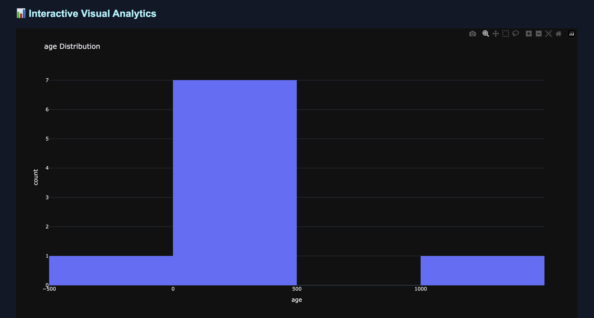

# 🚀 MasterClean


Automated Data Cleaning, Validation & Analytics Toolkit for Python.

MasterClean is a professional Python package that automates dataset cleaning, preprocessing, validation, profiling, visualization, and reporting using a single command.

It is designed for:

* Data Analysts
* Data Scientists
* ML Engineers
* Researchers
* Students
* Automation workflows

---

# ✨ Features

## Data Cleaning

* Automatic missing value handling
* Duplicate row removal
* Column standardization
* String cleanup
* Encoding-aware file loading

---

## Datatype Optimization

* Automatic numeric conversion
* Datetime detection
* Integer optimization
* Mixed datatype handling

---

## Validation Engine

* Negative value detection
* Outlier detection
* Invalid boolean detection
* Dataset quality warnings

---

## Analytics & Profiling

* Automated dataset profiling
* Numeric statistics
* Categorical summaries
* Memory usage analysis

---

## Visualization Engine

* Interactive Plotly dashboards
* Histograms
* Pie charts
* Boxplots
* Distribution analysis
* Category analytics

---

## Reporting

* Unified HTML analytics dashboard
* Validation summaries
* Interactive charts
* Automated report generation

---

## Developer Features

* Command Line Interface (CLI)
* Automated testing with pytest
* GitHub Actions CI/CD pipeline
* Modular package architecture

---

# 📦 Installation

## Install From PyPI

```bash
pip install masterclean
```

---

## Development Installation

### Clone Repository

```bash
git clone https://github.com/MohamedFaisal-11/masterclean.git
```

```bash
cd masterclean
```

---

### Create Virtual Environment

```bash
python -m venv venv
```

---

### Activate Environment

#### macOS / Linux

```bash
source venv/bin/activate
```

#### Windows

```bash
venv\Scripts\activate
```

---

### Install Package

```bash
pip install -e .
```

---

# 🚀 CLI Usage

## Clean Dataset

```bash
masterclean clean sample.csv
```

MasterClean automatically:

* Reads datasets
* Cleans missing values
* Removes duplicates
* Optimizes datatypes
* Detects validation issues
* Generates dashboards
* Exports cleaned data
* Creates HTML reports

---

## Show Version

```bash
masterclean version
```

---

# 📁 Supported File Types

Currently supported:

* CSV (.csv)

Upcoming support:

* Excel (.xlsx)
* JSON
* Parquet

---

# 📂 Generated Outputs

MasterClean automatically generates:

```text
cleaned_data.csv
report.html
```

These files contain:

* cleaned datasets
* validation summaries
* interactive analytics dashboards
* profiling insights

---

# 🐍 Python Usage

```python
from masterclean import (
    read_file,
    clean_data,
    optimize_dtypes,
    validate_data,
    generate_profile,
    generate_charts,
    generate_report,
    export_data
)

# Read dataset
df = read_file("sample.csv")

# Clean dataset
df = clean_data(df)

# Optimize datatypes
df = optimize_dtypes(df)

# Validate dataset
warnings = validate_data(df)

# Generate profile
profile = generate_profile(df)

# Generate charts
charts = generate_charts(df)

# Generate report
generate_report(
    df=df,
    warnings=warnings,
    profile=profile,
    charts=charts
)

# Export cleaned dataset
export_data(df)

print("MasterClean pipeline completed successfully")
```

---

# 📚 Examples

Example files are available inside:

```text
examples/
```

Run CLI example:

```bash
masterclean clean examples/sample.csv
```

Run Python example:

```bash
python examples/python_example.py
```

---

# 📊 Example Validation Output

```text
VALIDATION WARNINGS
========================================

⚠ Negative values found in 'age' (1 rows)

⚠ Possible outliers detected in 'salary' (1 rows)

⚠ Invalid boolean-like values found in 'active': {'maybe'}
```

---

# 📈 Dashboard Features

MasterClean generates a unified interactive HTML dashboard containing:

* Dataset summaries
* Validation warnings
* Profiling statistics
* Pie charts
* Histograms
* Boxplots
* Category analytics
* Interactive Plotly visualizations

---

# 🖼 Dashboard Preview



---

# 🏗 Architecture

```text
Read
   ↓
Clean
   ↓
Optimize
   ↓
Validate
   ↓
Profile
   ↓
Visualize
   ↓
Report
   ↓
Export
```

---

# 📂 Project Structure

```text
masterclean/
│
├── cleaner.py
├── validator.py
├── datatypes.py
├── profiler.py
├── visualizer.py
├── report.py
├── exporter.py
├── reader.py
├── cli.py
│
examples/
│
├── sample.csv
├── python_example.py
├── cli_example.md
│
tests/
│
├── test_cleaner.py
├── test_validator.py
├── test_reader.py
├── test_report.py
├── test_visualizer.py
│
.github/workflows/
│
└── tests.yml
```

---

# 🧪 Testing

Run tests using:

```bash
python -m pytest
```

Current Status:

* ✅ Automated tests passing
* ✅ GitHub Actions CI/CD passing

---

# 🔄 CI/CD

MasterClean uses GitHub Actions for:

* automated testing
* dependency validation
* continuous integration

---

# 📌 Current Version

```text
v1.0.0
```

---

# 🛣 Roadmap

Future improvements planned:

* Advanced schema validation
* Large dataset optimization
* Plugin architecture
* AI-powered cleaning suggestions
* Cloud deployment support
* Streamlit dashboard integration

---

# 🤝 Contributing

Contributions are welcome.

You can:

* report bugs
* suggest features
* improve documentation
* submit pull requests

---

# 📄 License

MIT License

---

# 👨‍💻 Author

Mohamed Faisal Maraicar N

GitHub:

https://github.com/MohamedFaisal-11/masterclean
